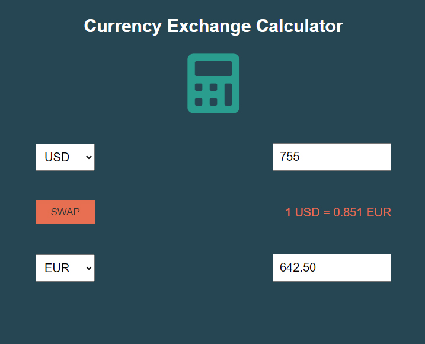

# Currency Exchange Calculator
 

 

# HTML CSS JavaScript

Idea for this project came from <a href="https://www.udemy.com/course/web-projects-with-vanilla-javascript/?utm_source=adwords&utm_medium=udemyads&utm_campaign=WebDevelopment_v.PROF_la.EN_cc.ROW_ti.8322&utm_content=deal4584&utm_term=_._ag_80385735315_._ad_535397279730_._kw__._de_c_._dm__._pl__._ti_dsa-774930035449_._li_1028595_._pd__._&matchtype=b&gclid=CjwKCAjw4qCKBhAVEiwAkTYsPPLLIUGIHeZhaBe2l9mziYC8ZLqcH_K2_0snpeXVmotmfniVO53SZRoC5DEQAvD_BwE"> here.</a>

Again, UI experience and app functionality should work exactly the same as above, 
but code is 100% mine, I worked it out without taking a look at Brad's solution.

Fun and very useful project for practicing variety of JavaScript language features.

